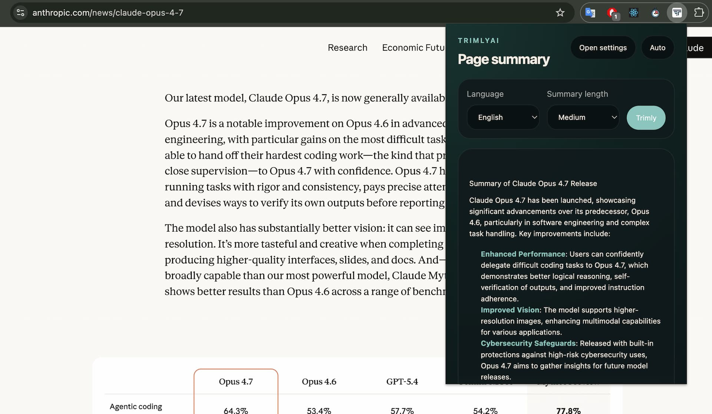
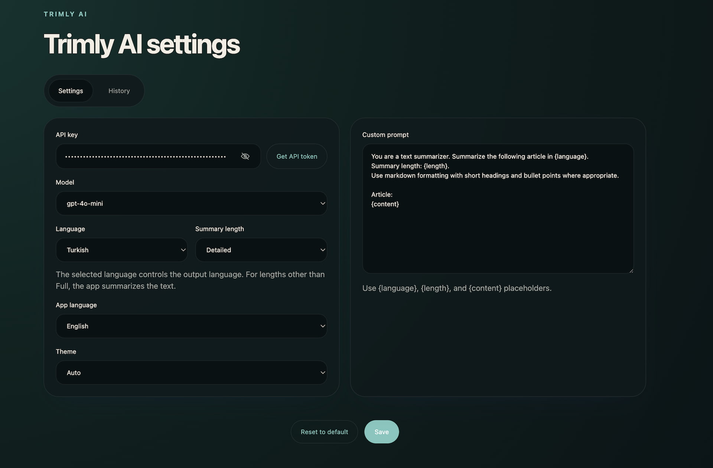

# Trimly AI

Trimly AI is a Chrome extension built with WXT, React, and TypeScript for summarizing or translating web content with OpenAI models.

It supports full-page extraction, selected-text summaries from the context menu, prompt customization, history tracking, and an expanded reader view for long outputs.

## Chrome Web Store

Coming soon. The extension is not published yet.

`Chrome Web Store: Coming Soon`

Install from GitHub Releases:
- English: [INSTALL_FROM_GITHUB_RELEASES.md](INSTALL_FROM_GITHUB_RELEASES.md)
- Türkçe: [INSTALL_FROM_GITHUB_RELEASES_TR.md](INSTALL_FROM_GITHUB_RELEASES_TR.md)

## Features

- Summarize readable web pages from the toolbar popup
- Process selected text directly from the right-click context menu
- Choose an output language, including `Original`
- Choose summary length: `Short`, `Medium`, `Long`, or `Full`
- Use `Full` mode for translation-only output without summarization
- Pick between supported OpenAI models in settings
- Save API key, model, prompt, language, and app-language preferences locally
- Reopen results in a dedicated reader tab with larger typography
- Keep history entries with summary, prompt, model, source, and timestamp
- Restore active popup jobs if the popup closes during streaming

## How It Works

1. Open the extension from the Chrome toolbar or select text on a page and use the context menu.
2. In the popup, choose the target language and summary length.
3. Press `Trimly` to start processing from the toolbar flow.
4. Copy the result or open it in a new tab for a larger reading view.
5. Manage API key, model, prompt, app language, and history from the options page.

## Screens

- `Popup`: starts summaries or translations and displays streaming results
- `Options`: manages settings and lets you inspect history entries
- `Reader`: shows the latest result in a larger, more readable layout

### Popup



### Settings



## Getting Started

### Install dependencies

```bash
npm install
```

### Start local development

```bash
npm run dev
```

### Load the extension in Chrome

1. Open `chrome://extensions`
2. Enable `Developer mode`
3. Click `Load unpacked`
4. Select the generated extension directory from WXT output

For production output, build first and load `.output/chrome-mv3/`.

## Available Scripts

- `npm run dev`: start the WXT development server
- `npm run build`: create a production build in `.output/chrome-mv3/`
- `npm run zip`: package the extension for distribution
- `npm run typecheck`: run TypeScript checks without emitting files

## Release

GitHub release automation is configured via `.github/workflows/release.yml`.

1. Bump `package.json` version (example: `0.1.1`)
2. Push commit to `main`
3. Create and push tag (example: `v0.1.1`)

```bash
git tag v0.1.1
git push origin v0.1.1
```

When the tag is pushed, GitHub Actions runs `build`, `typecheck`, and `zip`, then uploads `.output/*-chrome.zip` to the GitHub Release assets.

## Configuration

Trimly AI stores user settings in Chrome local storage.

- OpenAI API keys are entered from the options page
- API keys are not committed to the repository
- Users can choose the app language: `Auto`, `Türkçe`, or `English`
- Users can customize the default prompt template
- `Full` summary length switches the request into translation-only mode

## Supported Flows

### Toolbar popup

- Opens a compact UI with language and summary-length selectors
- Starts processing only after clicking `Trimly`
- Restores the active job if the popup is closed and reopened on the same page

### Context menu

- Works on selected text
- Starts immediately after the context-menu action

### Reader tab

- Opens the latest result in a separate extension page
- Useful for reading long summaries or translations outside the popup

### History

- Stores title, source URL, timestamp, summary, final prompt, and model
- Lets users inspect prompt details for previous runs

## Project Structure

```text
entrypoints/
  background.ts       Extension background logic and OpenAI request flow
  content.ts          Page content extraction
  popup/              Toolbar popup UI
  options/            Settings and history UI
  reader/             Expanded reader view
src/
  config/             Prompt configuration
  lib/                Shared browser, storage, i18n, markdown, and OpenAI helpers
  types/              Shared TypeScript types
public/
  _locales/           Chrome extension localization files
```

## Technical Notes

- The extension uses Chrome Manifest V3.
- Popup close behavior is controlled by Chrome and cannot be prevented.
- Active popup jobs are persisted so users do not lose in-progress output when the popup closes.
- OpenAI requests are sent to `https://api.openai.com/v1/chat/completions`.

## Validation

Before handing off changes, run:

```bash
npm run typecheck
npm run build
```

Recommended manual smoke tests:

- Toolbar popup summary flow
- Context-menu selected-text flow
- Reader tab flow
- Settings save/reset flow
- History detail and prompt visibility flow
- App language switching between `Auto`, `Türkçe`, and `English`

## Security

- Do not commit secrets or user API keys.
- Be careful when changing extension permissions, host permissions, or manifest settings.
- Any permission changes affect user trust and extension review requirements.

## Privacy Policy

Privacy policy: `PRIVACY_POLICY.md`

## License

This project is licensed under the MIT License. See `LICENSE` for details.
